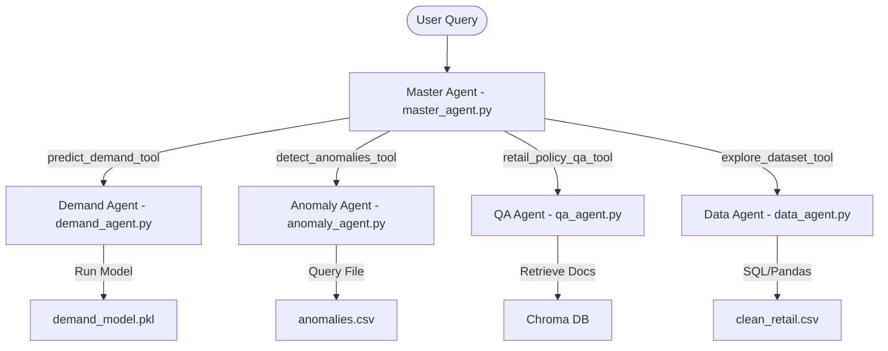

# Smart Retail Assistant — Master Context & Debrief Document

This document serves as the master source of truth for the **Smart Retail Assistant** project. It provides all necessary architectural, data, machine learning, generative AI, and database details for any AI assistant to understand the project instantly and provide correct answers and implementations.

---

## 1. Project Overview & Identity

| Property | Details |
| :--- | :--- |
| **Project Name** | Smart Retail Assistant |
| **Domain** | Smart Retail (Demand Forecasting + Anomaly Detection + Policy Q&A + Dataset Exploration) |
| **Architecture** | FastAPI Backend + Multi-Agent AI System + Scikit-Learn ML Engines + MongoDB Logging + Chroma RAG |
| **Python Version** | `3.11` |
| **Primary Run Command** | `uvicorn backend.main:app --reload` |
| **Swagger Docs URL** | `http://localhost:8000/docs` |
| **Health Check Endpoint** | `GET /health` (returns service health status) |

---

## 2. Directory & Project Structure

```text
Smart Retail Assistant/
├── .env                          # Local environment variables and secrets (not committed)
├── .gitignore
├── Dockerfile                    # Containerization instructions
├── README.md                     # Rebuild guide and summary
├── requirements.txt              # Pip dependencies
│
├── .github/
│   └── workflows/
│       └── deploy.yml            # Empty deployment workflow (CI/CD template)
│
├── backend/
│   ├── __init__.py
│   ├── main.py                   # Entry point for FastAPI (registers routes, loads .env)
│   ├── database.py               # MongoDB client singleton, Pydantic log schemas, and inserts
│   │
│   ├── agents/
│   │   ├── __init__.py
│   │   ├── master_agent.py       # Main LangChain OpenAI Tools agent coordinating sub-agents/tools
│   │   ├── demand_agent.py       # Extracts feature values -> runs GradientBoosting -> returns business insights
│   │   ├── anomaly_agent.py      # Filters anomalies.csv -> LLM analyzes outliers and reports findings
│   │   ├── qa_agent.py           # Retrieves store policy information using the RAG pipeline
│   │   └── data_agent.py         # LangChain Pandas Dataframe Agent for direct database queries/exploration
│   │
│   ├── apis/
│   │   ├── __init__.py
│   │   ├── ingest_data.py        # POST /api/data/upload — Uploads raw CSV to data/retail_data.csv
│   │   ├── ingest_kb.py          # POST /api/kb/upload — Chunks and embeds text into ChromaDB
│   │   ├── predict.py            # GET /metrics, POST /demand, POST /anomaly ML prediction endpoints
│   │   ├── search.py             # POST /api/search/ — Direct RAG query (ignores agent routing)
│   │   └── agent.py              # POST /api/agent/chat — Main endpoint querying master_agent
│   │
│   ├── ml/
│   │   ├── __init__.py
│   │   ├── data_pipeline.py      # Cleans raw retail data and saves it to data/clean_retail.csv
│   │   ├── train_demand.py       # Aggregates daily demand and trains GradientBoostingRegressor
│   │   ├── train_anomaly.py      # Fits StandardScaler + IsolationForest on financial records
│   │   └── trained_models/
│   │       ├── demand_model.pkl  # Pickled demand regression model
│   │       └── anomaly_pipeline.pkl # Pickled anomaly preprocessing + IsolationForest pipeline
│   │
│   ├── rag/
│   │   ├── __init__.py
│   │   ├── embeddings.py         # Text splitter and Azure OpenAI Embeddings vectorization
│   │   ├── vectorstore.py        # Similarity search queries and database loading
│   │   ├── rag_chain.py          # Prompt engineering and Azure OpenAI LLM Q&A runner
│   │   └── chroma_db/            # Persisted local vector database files
│   │
│   └── tests/
│       ├── test_api.py           # FastAPI endpoints integration tests
│       ├── test_ml.py            # ML prediction and anomaly agents test suite
│       └── test_rag.py           # RAG retrieval and Q&A accuracy checks
│
├── data/
│   ├── retail_data.csv           # Raw dataset (uploaded or placed manually)
│   ├── clean_retail.csv          # Preprocessed data generated by data_pipeline.py
│   └── anomalies.csv             # Anomaly rows (anomaly_flag == 1) saved by train_anomaly.py
│
└── docs/
    ├── retail_knowledge.txt      # Raw policies text for the RAG system
    ├── anomaly_plot.png          # Scatter plot visual of anomalies
    ├── demand_forecast_plot.png  # Forecast vs actual line plot
    ├── demand_metrics.json       # Model accuracy metrics (MAE, RMSE, R2)
    └── demand_feature_importance.json # Importance score for each of the 16 features
```

---

## 3. Environment Configurations (`.env`)

The project requires the following keys defined in a local `.env` file at the root. The FastAPI app loads these variables at start:

```env
# MongoDB Atlas Database Setup
MONGO_URL=mongodb+srv://<username>:<password>@<cluster>.mongodb.net/
DATABASE_NAME=retail_database

# Azure OpenAI GenAI Configuration
AZURE_OPENAI_ENDPOINT=https://<resource-name>.openai.azure.com/
AZURE_OPENAI_KEY=<your-azure-openai-key>
AZURE_OPENAI_API_KEY=<your-azure-openai-key> # Double-defined as some LangChain components expect this format
AZURE_OPENAI_DEPLOYMENT=gpt-4o
AZURE_EMBEDDING_DEPLOYMENT=text-embedding-ada-002
```

---

## 4. API Endpoints Reference

All API routes are served on `http://localhost:8000` by default.

| HTTP Method | Route | Description | Input Schema / Payload | Output Schema |
| :--- | :--- | :--- | :--- | :--- |
| **GET** | `/health` | Server status | None | `{"status": "healthy", "service": "..."}` |
| **GET** | `/` | Welcoming root endpoint | None | `{"message": "welcome to digital retail assistant"}` |
| **POST** | `/api/data/upload` | Ingest raw retail CSV file | Multipart Form Data (`file: UploadFile`) | `{"message": "...", "rows_ingested": int, "next_steps": "..."}` |
| **POST** | `/api/kb/upload` | Upload `.txt` file and embed into Chroma | Multipart Form Data (`file: UploadFile`) | `{"message": "...", "chunks_embedded": int}` |
| **GET** | `/api/predict/metrics` | Returns metrics from `demand_metrics.json` | None | JSON file content mapping model training MAE, RMSE, R² |
| **POST** | `/api/predict/demand` | Direct demand prediction using LLM parameters | `{"query": "string"}` | `{"prediction": "string"}` (Includes forecast & LLM insight) |
| **POST** | `/api/predict/anomaly` | Query the detected anomalies directly | `{"query": "string"}` | `{"prediction": "string"}` (Answers counts, statistics, or list) |
| **POST** | `/api/search/` | Direct RAG search query | `{"query": "string"}` | `{"query": "...", "answer": "..."}` |
| **POST** | `/api/agent/chat` | Main orchestrated chatbot interaction | `{"message": "string"}` | `{"intent": "multi_agent", "query": "...", "response": "..."}` |

---

## 5. MongoDB Database Layer (`backend/database.py`)

A singleton client is established for database connectivity, throwing clear errors if variables are not configured in the environment.

### Collections
Inside the database specified by `DATABASE_NAME` (defaults to `retail_database`), a single collection `logs` stores two types of logging entries distinguished by the custom field `log_type`.

### Schemas (Pydantic Models)

#### `PredictionLog`
Stores input configurations and predictions made directly via ML APIs.
*   `prediction_type` (str): `"demand"` or `"anomaly"`
*   `input_data` (str): JSON-serialized string of user query inputs
*   `prediction_result` (str): String output returned by the model
*   `timestamp` (datetime): Auto-generated timestamp (UTC)

#### `InteractionLog`
Logs client-chatbot conversations handled by the orchestrated multi-agent API.
*   `intent` (str): `"multi_agent"` (or specific routed intents)
*   `query` (str): Original query from the user
*   `response` (str): Complete response generated by the agent
*   `timestamp` (datetime): Auto-generated timestamp (UTC)

---

## 6. Machine Learning Pipelines

The project houses two independent ML engines that process the cleaned transactional dataset.

### A. Data Engineering Pipeline (`backend/ml/data_pipeline.py`)
Cleans and standardizes the uploaded raw retail data file.
*   **Input**: `data/retail_data.csv`
*   **Output**: `data/clean_retail.csv`
*   **Operations**:
    1.  Keeps only these core transactional columns: `Sales`, `Quantity`, `Discount`, `Profit`, `Outlet Type`, `City Type`, `Category of Goods`, `Region`, `State`, `Segment`, `Ship Mode`, `Sub-Category`, and `Order Date`.
    2.  Converts `Order Date` into standard datetime objects.
    3.  Drops any records containing missing values (`NaN`).
    4.  Excludes outliers/invalid inputs by enforcing `Sales > 0` and `Quantity > 0`.
    5.  Derives temporal features: `month`, `day_of_week`, `quarter`, and `year`.
    6.  Encodes categorical columns (e.g. `Category of Goods`, `Region`) into numerical categories using label encoding, suffixed with `_enc`.

### B. Demand Forecasting Engine (`backend/ml/train_demand.py`)
Trains a regressor to forecast unit sales quantities.
*   **Algorithm**: `GradientBoostingRegressor` (from `scikit-learn`)
*   **Workflow**:
    1.  Groups transactional entries daily by `Order Date` and `Category of Goods_enc`.
    2.  Derives advanced temporal elements: `month`, `quarter`, `week_of_year`, `day_of_month`, `day_of_week`, `is_weekend`, and `festival_pressure` (flagged `1` for high-volume months: Jan, Mar, Aug, Oct, Nov, Dec).
    3.  Computes lag features: `lag_1`, `lag_7`, `lag_14`, and `lag_30` days.
    4.  Computes rolling features: `rolling_mean_7` and `rolling_mean_30` days.
    5.  Transforms the target label `total_qty` using `np.log1p` for numerical stability.
    6.  Trains on **16 Ordered Features**:
        ```text
        month, quarter, week_of_year, day_of_month, day_of_week,
        is_weekend, festival_pressure, Category of Goods_enc,
        avg_discount, avg_sales,
        lag_1, lag_7, lag_14, lag_30,
        rolling_mean_7, rolling_mean_30
        ```
    7.  Splits data with a **90% Train / 10% Test time-series split** (no shuffling to prevent data leakage).
    8.  During inference, predictions are reverted using `np.expm1`.
    9.  Saves:
        *   Trained model to `backend/ml/trained_models/demand_model.pkl`.
        *   Calculated MAE, RMSE, and $R^2$ to `docs/demand_metrics.json`.
        *   Feature importance score map to `docs/demand_feature_importance.json`.
        *   Evaluation plots (Forecast accuracy & Residual errors) to `docs/demand_forecast_plot.png`.

### C. Anomaly Detection Engine (`backend/ml/train_anomaly.py`)
Identifies suspicious transactions or extreme outliers.
*   **Algorithm**: scikit-learn Pipeline with `StandardScaler` + `IsolationForest`.
*   **Input Features**: `["Sales", "Quantity", "Discount", "Profit"]`
*   **Hyperparameters**: `contamination=0.05` (automatically marks the top 5% extreme data points as outliers).
*   **Flagging**: A output of `-1` from `IsolationForest` translates to an anomaly flag `1`, while normal entries get `0`.
*   **Output**: Fits model to `backend/ml/trained_models/anomaly_pipeline.pkl` and exports isolated records to `data/anomalies.csv`. Saves visual scatter plot to `docs/anomaly_plot.png`.

---

## 7. Generative AI & Multi-Agent Architecture

The chat interface is powered by a multi-agent cooperative network designed using LangChain.



### A. Master Agent (`backend/agents/master_agent.py`)
This is the system's central coordinator. It is built as an **OpenAI Tools Agent** (`create_openai_tools_agent`) powered by Azure OpenAI GPT-4o.
Instead of utilizing standard intent routers, it makes run-time decisions on which tool to invoke. The agent has access to 4 tool functions:

1.  **`predict_demand_tool`**:
    *   *Purpose*: Predicts or forecasts future unit demand.
    *   *Implementation*: Invokes `backend.agents.demand_agent.run`.
2.  **`detect_anomalies_tool`**:
    *   *Purpose*: Finds fraud, transaction outliers, or unusual financial entries.
    *   *Implementation*: Invokes `backend.agents.anomaly_agent.run`.
3.  **`retail_policy_qa_tool`**:
    *   *Purpose*: Answers customer service questions regarding refunds, shipping, or store rules.
    *   *Implementation*: Invokes `backend.agents.qa_agent.run`.
4.  **`explore_dataset_tool`**:
    *   *Purpose*: Count rows, calculate aggregate historical sales, or analyze past trends.
    *   *Implementation*: Invokes `backend.agents.data_agent.run_data_exploration`.

---

### B. Specialized Sub-Agents

#### 1. Demand Agent (`backend/agents/demand_agent.py`)
*   **Phase 1 (Parameter Extraction)**: Prompts GPT-4o to parse raw user queries and extract the 16 numerical features needed by the regression model. If columns or values cannot be inferred, it falls back to preset default values: `[6, 2, 24, 15, 1, 0, 0, 0, 0.1, 500, 50, 45, 45, 40, 48, 45]`.
*   **Phase 2 (ML Inference)**: Unpickles `demand_model.pkl` and calculates `np.expm1(model.predict(features))`.
*   **Phase 3 (Business Insights)**: Sends the predicted quantity back to the LLM to generate a brief (1-2 sentences) professional business justification.
*   **Result**: Returns `"Predicted Demand: X units\n<Insight string>"`

#### 2. Anomaly Agent (`backend/agents/anomaly_agent.py`)
*   **Logic**: Reads the generated `data/anomalies.csv` file. It filters for records with `anomaly_flag == 1` and isolates human-readable columns.
*   **Context Passing**: Passes the top 100 anomalous rows as tabular context inside the system prompt of GPT-4o.
*   **Response Generation**: The LLM isolates counts, highlights specific metrics, or summarizes anomalies according to user instructions. Prompt design strictly instructs the model to return plain Markdown tables or direct answers without preamble.

#### 3. QA Agent (`backend/agents/qa_agent.py`)
*   **Logic**: Wrapper function calling the RAG chain directly (`backend/rag/rag_chain.py`).

#### 4. Data Agent (`backend/agents/data_agent.py`)
*   **Logic**: Utilizes LangChain's experimental `create_pandas_dataframe_agent` with Azure OpenAI GPT-4o.
*   **Operation**: The agent has permission to compile and run safe local python code (`allow_dangerous_code=True`) against `data/clean_retail.csv`. This enables direct computation of historical metrics, group-by aggregates, and statistical counts from the actual transaction files.

---

## 8. Retrieval Augmented Generation (RAG) Setup

The RAG stack handles natural language policy queries and FAQs.

*   **Embedding Generator (`backend/rag/embeddings.py`)**:
    *   *Deployment*: Azure OpenAI `text-embedding-ada-002`.
    *   *Source Document*: `docs/retail_knowledge.txt` (contains store operational parameters, shipping information, and FAQs).
    *   *Chunking Mechanism*: LangChain `RecursiveCharacterTextSplitter` configured with `chunk_size=300` and `chunk_overlap=50`.
    *   *Vector Store*: Persisted to disk at `backend/rag/chroma_db/`.
*   **Retriever Chain (`backend/rag/rag_chain.py`)**:
    *   Uses Chroma database as vector retriever querying top 3 most relevant segments ($k=3$).
    *   Queries Azure OpenAI Chat model GPT-4o (temperature: `0.2`).
    *   **Strict Alignment Rule**: If the retrieved documents do not contain the answer, the prompt instructs the model to output exactly: `"I do not have information on that."` (no assumptions or hallucinations).

---

## 9. Quick Rebuild & Run Guide

Follow these sequential commands to set up, populate, train, and launch the assistant from scratch:

```bash
# 1. Navigate to project root
cd "Smart Retail Assistant"

# 2. Set up virtual environment
python -m venv .venv
.venv\Scripts\activate          # On Windows
# source .venv/bin/activate     # On macOS/Linux

# 3. Install requirements
pip install -r requirements.txt

# 4. Populate .env file
# Ensure MONGO_URL, DATABASE_NAME, AZURE_OPENAI_KEY, AZURE_OPENAI_ENDPOINT, and deployment names are configured.

# 5. Place retail_data.csv in the data/ folder.

# 6. Run the preprocessing data pipeline
python -m backend.ml.data_pipeline

# 7. Train the models
python -m backend.ml.train_demand
python -m backend.ml.train_anomaly

# 8. Index the store policies (RAG)
python -m backend.rag.embeddings

# 9. Start the API Server
uvicorn backend.main:app --reload

# 10. Run tests
pytest backend/tests/ -v
```

---

## 10. Known Issues & Common Solutions

1.  **`MONGO_URL is not set`**:
    *   *Cause*: `database.py` loaded before `load_dotenv()` executed.
    *   *Solution*: Ensure `load_dotenv()` is called at the absolute top of `backend/main.py`.
2.  **Missing Pickled Models**:
    *   *Cause*: Calling predicting endpoints without running training files.
    *   *Solution*: Run `train_demand.py` and `train_anomaly.py` before querying `/api/predict/demand` or `/api/predict/anomaly`.
3.  **Missing `logger` in `predict.py`**:
    *   *Cause*: Code attempts to log a traceback with `logger.error(...)` but `logger` variable isn't imported or instantiated in the file.
    *   *Solution*: Add `import logging; logger = logging.getLogger(__name__)` at the top of `backend/apis/predict.py`.
4.  **AZURE_OPENAI_API_KEY vs AZURE_OPENAI_KEY**:
    *   *Cause*: Different LangChain wrappers search for different environment keys.
    *   *Solution*: Keep both defined in your `.env` pointing to the exact same Azure key.
